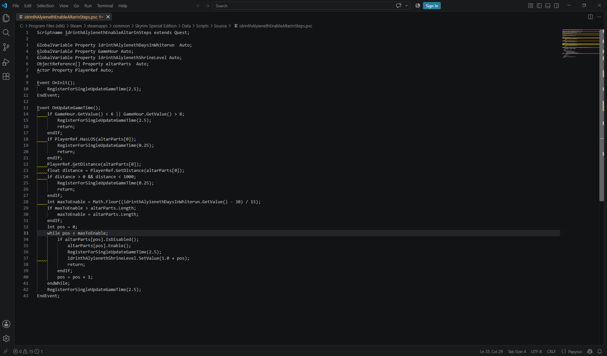

# Papyrus Lint [](https://sonarcloud.io/summary/new_code?id=Idrinth_papyrus-lint) [](link=https://discord.gg/idrinth) [](https://www.nexusmods.com/skyrimspecialedition/mods/189862) [](https://github.com/idrinth/papyrus-lint)


**Papyrus Lint catches bugs that CreationKit's compiler lets through.**
`PapyrusCompiler.exe` only checks that a script is syntactically valid — it
will happily compile a script that dereferences a `None` object at
runtime, passes a `String` where an `Int` is expected, returns the wrong
type from a function, compares an `Int` to a `Float` inexactly, or
contains a branch or statement that can never execute. Those bugs don't
show up until later, as a CTD, a quest stage that never advances, or a
value that's silently wrong — often far from the line that actually
caused them, and long after the mod author has lost the context to spot
it. Papyrus Lint scans your `.psc` source for exactly these patterns (see
the full list below) before you ship, on top of the formatting/style
issues a linter usually catches, so a mod author finds them at write time
instead of from a bug report.

## Simple Example

```papyrus
Function DoSomething(Actor a, Actor b, Form SomeItem)
    a.RemoveItem(SomeItem, 1, b);
EndFunction
```

This compiles, but the likely desired version is:

```papyrus
Function DoSomething(Actor a, Actor b, Form SomeItem)
    a.RemoveItem(SomeItem, 1, false, b);
EndFunction
```

The strict boolean check identifies this issue because the first call passes
the `Actor` value `b` to a `Bool` parameter.


Just drop your file or archlist here and see the results.

## What this is NOT

- A compiler (this uses the standard papyrus compile under the hood)
- An editor(see VSCode or Sublime Text for editors supported by our plugins)
- A guarantee a script is fit for purpose
- A replacement for proper testing



## What is a linter?

A linter is a tool that scans source code for patterns that are likely to be
mistakes, bad practice, or inconsistent style, without actually running the
code. It works from heuristics — recognizable patterns known to often cause
problems — rather than proving that a given line is definitely wrong.
Because of that, a linter can produce **false positives**: diagnostics on
code that is actually fine, especially for patterns the checks intentionally
can't fully resolve (see e.g. "Strict boolean check" or "None used as an
existing Form" below, which skip anything they can't determine with
confidence rather than guess). It's normal to disagree with an individual
diagnostic and dismiss it.

Treat every diagnostic here as **advice, not a guaranteed defect report**: a
suggestion worth a second look, not proof the code is broken. Use your own
judgment for whether a flagged line needs changing, and use the
[`; @disable`](#disabling-a-lint-on-a-specific-line) comment below to
silence a specific rule on a specific line when you've decided it doesn't
apply.


## Implemented Lints


### Formatting

| Lint | Description | Auto-Fix |
| --- | --- | --- |
| **Trailing whitespace** | Flags, as a `[warning]`, lines that end with trailing spaces or tabs. | ✓ |
| **Space after comma** | Requires, as a `[warning]`, whitespace after commas in argument lists. | ✓ |
| **Semicolon at end of line** | Requires, as a `[warning]`, a trailing semicolon on each non-empty line or forbids terminal semicolons, according to the selected setting. | ✓ |
| **Formatting checks** | Flags, as a `[warning]`, lines whose indentation doesn't match the configured style/width (`indentation`/`indentation_width`) for their nesting depth. A script whose structure can't be identified (e.g. it doesn't lex cleanly) is left unchecked rather than guessed at. | ✓ |
| **Whitespace interrupting property/method chaining** | Flags, as an `[error]`, a space or tab immediately before or after a `.` member/method access (e.g. `SomeProperty . DoThing()`), since it interrupts the chain for no benefit. A `.` inside a `Float` literal (e.g. `1.5`) is never flagged. The fix closes the gap on whichever side(s) have it, without reaching across a newline (a chain continued onto another physical line is left alone). | ✓ |
| **Exclamation mark spacing** | Flags, as a `[warning]`, a `!` negation operator not followed by exactly one space (e.g. `!bReady` or `!  bReady`), since a bit of breathing room makes the negation easier to spot. Never flags `!=`, which the lexer tokenizes separately. The fix inserts a space where there is none and collapses a longer run of spaces/tabs down to one. | ✓ |
| **Type name casing** | Flags, as a `[warning]`, a script's declared type name (the identifier following `ScriptName`) if it doesn't follow the configured `type_casing` convention (`PascalCase`, `camelCase`, `lowercase`, or `UPPERCASE`). Only the script's own declared name is checked and fixed, never its `Extends` target, since that type is declared (and presumably already checked) in another script. The fix only changes letter casing, preserving the name's characters so it remains compatible with its `.psc` filename; a violation that would require a substantive rename (such as removing an underscore for `PascalCase`) is left for the user to rename together with the file. | ✓ |
| **Identifier casing** | Flags a declared function/event, property, state, parameter, or local/script variable whose name doesn't match the configured `identifier_casing` style: `camelCase`, `PascalCase`, `snake_case`, or `CONSTANT_CASE`. `ScriptName` itself is never checked by this lint (see "Type name casing" below). A parameter has no location of its own, so it's reported on its enclosing function's line. The automatic fix renames each flagged declaration and its references only when the conversion preserves every underscore in its original position; fixes that would add, remove, or move underscores are left for the user because they constitute a substantive rename. | ✓ |
| **Spacing around logical/comparison operators** | Requires, as a `[warning]`, exactly one space on either side of `&&`, `\|\|`, `==`, `!=`, `>`, `<`, `>=`, and `<=`. A side whose whitespace reaches a newline (the operator opens or closes a statement continued across physical lines) is left unchecked on that side. The fix normalizes each flagged side to a single space, without reaching across a newline. | ✓ |
| **Property sorting** | Flags, as a `[warning]`, a `Property` declaration that isn't sorted by type and then alphabetically by name, or that isn't declared immediately after the `ScriptName` line, before any variable, function, or state declaration (an `Import` isn't tracked closely enough to count against this). Disabled by default, since reordering a script's declared properties is a more invasive change than the rest of these lints; a project opts in via `rules.property_sorting`. The fix relocates each property's own declaration lines (its full `Property`/`EndProperty` block, for a non-auto property) as a group right after `ScriptName`, in sorted order; a documentation comment placed directly above a property is left behind rather than moved with it. | ✓ |

### Performance

| Lint | Description | Auto-Fix |
| --- | --- | --- |
| **Forbidden/discouraged function usage** | Flags calls to functions listed in `rules/forbidden-functions.yaml` (e.g. slow or blocking native calls), with a configurable severity and an explanatory message per entry. | |
| **Slow function usage** | Flags calls to functions listed in `rules/slow-functions.yaml` that have a faster equivalent available, and suggests the quicker alternative. The fix replaces the complete call with that rule's supplied replacement, preserving the original argument where the replacement uses the `value` placeholder. | ✓ |
| **Short wait/update interval** | Flags, as a `[warning]`, a call to `Utility.Wait`, `RegisterForUpdate`, `RegisterForSingleUpdate`, `RegisterForUpdateGameTime`, or `RegisterForSingleUpdateGameTime` whose interval argument folds to a compile-time-constant number below the configurable `min_wait_interval` (default `0.1`), since an interval that short runs far more often than is typically useful and can add up to meaningful performance overhead. `Utility.Wait` is only matched when qualified by that literal script name, the same way the "Forbidden/discouraged function usage" lint treats native singletons; the `RegisterFor*` family matches unqualified or through any receiver. Only an argument built entirely from literals (combined with arithmetic and unary operators) is checked; one that depends on an identifier, a call, `Self`/`Parent`, a member/index access, a cast, or a `new` array is left unflagged rather than guessed at. | |
| **Repeated GlobalVariable.GetValue() calls** | Flags, as an `[info]`, a `GetValue()` call repeated on the same receiver across the conditions of a single `If`/`ElseIf` chain (e.g. `If gv.GetValue() == 1.0` / `ElseIf gv.GetValue() == 2.0`), since none of the chain's earlier branch bodies run before a later condition is evaluated, so the value can't have changed between those reads — it can be read into a local variable once ahead of the chain instead. Like "Slow function usage", a call's receiver can't generally be resolved back to a `GlobalVariable`-typed script, so this matches by the `GetValue` method name alone (case-insensitively, with no arguments); it's the only native method with that name (see `rules/native-methods.yaml`), so this doesn't misfire on unrelated types. Disabled by default, since a chain that reads the same global more than once is often written that way deliberately for readability and the performance cost is usually negligible outside a hot code path; a project opts in via `rules.repeated_getvalue`. | |

### Reliability

| Lint | Description | Auto-Fix |
| --- | --- | --- |
| **Getter usage without saving result** | Flags calls to functions whose names begin with `Get` (case-insensitively) whose result is discarded, whether the call stands alone (`GetValue()`) or only feeds a comparison, arithmetic, or logical operator whose own result is then discarded too (e.g. `GetDistance(target) > 0` on its own line, with no assignment, `Return`, or condition around it). | |
| **Strict boolean check** | Flags `If`/`ElseIf`/`While` conditions that aren't already a `Bool` value or expression, instead of relying on Papyrus's implicit conversion to boolean. Only conditions whose type can be determined locally (locals, parameters, properties, literals, casts, and comparison/logical expressions) are checked; a condition that depends on a function call or a member access is left unflagged rather than risk a false positive. By default (`bool_like_int: true`), the `Int` literal `1` or `0` used directly as a condition is allowed as a common "bool-like" idiom; any other `Int` value (including a variable or property that happens to hold `0`/`1`) is still flagged, and setting `bool_like_int: false` flags the literals too. | |
| **Argument type check** | Flags call-site arguments whose type doesn't match the callee's declared parameter type (e.g. passing a `String` where an `Int` is expected), allowing the implicit `Int`-to-`Float` widening Papyrus itself allows, as well as passing an object whose script extends (directly or transitively) the parameter's type (e.g. passing an `Armor` where a `Form` is expected, or an `Actor` where an `ObjectReference` is expected). Calls to functions declared in the same script are always checked; when linting a `.psc` file dropped in the app, calls to functions declared on other scripts under the project root (e.g. `SomeProperty.DoThing(...)`) are checked too, by resolving those scripts' signatures (including through `Extends`), and the `Extends` chain of an argument's own script is likewise resolved from the project root to allow compatible subtypes. Native engine types (e.g. `Actor`, `ObjectReference`, `Form`, `Spell`) whose own `.psc` isn't part of the project fall back to the common Skyrim/Fallout 4 native class hierarchy listed in `rules/native-types.yaml`, so a subtype relationship between them is still recognized. A call whose target or argument type can't be determined is skipped rather than guessed at. | |
| **Return type check** | Flags `Return` statements whose value's type doesn't match the enclosing function's declared return type (e.g. returning a `String` from a Function declared `Int`), allowing the implicit `Int`-to-`Float` widening Papyrus itself allows, as well as returning an object whose script extends (directly or transitively) the declared return type (e.g. returning an `Armor` from a Function declared `Form`, or an `Actor` from a Function declared `ObjectReference`). When linting a `.psc` file dropped in the app, a returned value's own script's `Extends` chain is resolved from the project root to allow compatible subtypes there too, with the same native-type fallback used by the argument type check for engine types like `Actor`/`ObjectReference`/`Form`. A `Return` whose value's type can't be determined, or with no declared return type, is skipped rather than guessed at. | |
| **Inherited function override** | Flags, as an `[info]`, a function declared on this script that shares its name with a function declared on the script it `Extends` (directly or transitively) — the local declaration silently replaces the inherited one. This is often intentional (e.g. overriding an `Event OnInit()` handler), so it's informational rather than a warning. Only checked when linting a `.psc` file dropped in the app, by resolving the `Extends` chain from the project root; a function declared inside a `State` block is not checked (state-based override is a separate mechanism from `Extends`). | |
| **Argument naming consistency** | Flags, as a `[warning]`, a function declared on this script whose parameter name doesn't match (case-insensitively) the corresponding parameter of the same-named function declared on the script it `Extends` (directly or transitively) — since Papyrus resolves a named-argument call against the declared type of the reference it's called through, a renamed parameter on an override can silently misdirect (or fail to compile) a caller using the parent's names. Only checked when linting a `.psc` file dropped in the app, by resolving the `Extends` chain from the project root; a function declared inside a `State` block is not checked, and only parameter positions present on both declarations are compared. | |
| **State function signature mismatch** | Flags, as an `[error]`, a function or event declared inside a `State` block whose parameter count/types or return type doesn't match the same-named declaration in the script's "empty state" (the one declared directly on the script, outside any `State` block) — Papyrus requires these to match identically for the state version to be recognized as an override of the empty-state one at all, rather than becoming a distinct, effectively unreachable function. Only compared against an empty-state declaration already present on the script being linted; a state function may instead validly match one declared on a parent script (per the language spec), which this lint has no way to resolve, so that case is left unflagged. | |
| **Strict numeric type check** | Flags implicit comparisons (`==`, `!=`, `<`, `<=`, `>`, `>=`) between an `Int` value and a `Float` value without an explicit cast making the comparison exact. Only comparisons whose operand types can be determined locally are checked. | |
| **Explicit return on every path** | Flags, as an `[error]`, a typed function/event with a code path that falls off the end of its body without a `Return`, since Papyrus then silently returns that type's default value (`0`, `""`, `False`, or `None`) instead of one the author chose. A `Return` with no value still counts as long as it's reached (`return_types` covers a value's actual type); an `If` only counts when every branch, including an `Else`, returns, and a `While` loop is never assumed to guarantee one since it may run zero times. A native function has no body to inspect and is never flagged. | |
| **Unresolved script reference** | Flags, as a `[warning]`, an unresolved parent in `Extends`, an unresolved type annotation, or a call through Papyrus's static/global call syntax (e.g. `MyMissingScript.DoThing()`) whose target script can't be found. Primitive types and native engine types are recognized without project-side source. Only a call whose object is a bare identifier not already known as a local variable, parameter, or property is considered a script reference at all — one resolved through a variable or property is left to the "Argument type check"/"Return type check" lints instead. Only checked when linting with project context, by resolving names against `.psc` files under the project root the same way the argument/return type checks do, with native types and singleton scripts supplied by the built-in rule data. | |
| **Non-static function call** | Flags, as an `[error]`, a call through Papyrus's static/global call syntax (e.g. `MyScript.DoThing()`) whose target function resolves but isn't declared `Global` on that script, since Papyrus only allows that syntax to reach a script's `Global` functions — calling an ordinary instance function that way fails to compile. Uses the same "bare identifier not already known as a local variable, parameter, or property" rule as the "Unresolved script reference" lint above to tell a script reference apart from an instance call; a call whose script or function can't be resolved at all is left unflagged (see that lint instead). Only checked when linting with project context, by resolving the target script's functions the same way the argument/return type checks do. | |
| **Static function called via instance** | Flags, as a `[warning]`, the mirror case of "Non-static function call" above: a call reaching a `Global` function through an actual object reference (a local variable, parameter, property, cast, or array element, e.g. `akOtherActor.MyGlobalHelper()`) instead of Papyrus's static/global call syntax (`MyScript.MyGlobalHelper()`). Papyrus allows this — a `Global` function ignores whatever reference it's called through — but it can read as a mistake, since a reader (or the author, if the call was copy-pasted from an instance method) may expect the object to matter. `Self`/`Parent` are never flagged, since calling a script's own `Global` function through `Self` for symmetry with its other `Self.Whatever()` calls is a reasonable, common style rather than a likely mistake. Only checked when linting with project context, by resolving the target script's functions the same way the argument/return type checks do. | |
| **GoToState state reference** | Flags, as a `[warning]`, a `GoToState("Name")` call (bare or `self.GoToState(...)`) whose target isn't declared as a `State` on this script, since a typo'd or renamed state name still compiles — the engine just silently falls back through its state resolution algorithm instead of raising an error, so the call quietly never takes effect. `GoToState("")`, which switches back to the empty state, is always valid. Only a literal string argument is checked; one built from anything else is left unflagged rather than guessed at. A target undeclared on this script is only flagged when this script has no `Extends` target at all, since it may otherwise be declared on a script further up that (unresolved) `Extends` chain — a legitimate way to forward-declare a state for a not-yet-written child script to implement. When linting a `.psc` file dropped in the app, that chain is resolved from the project root too, the same way the argument/return type checks resolve their own, so a target declared on an ancestor script is recognized rather than flagged. | |
| **Total named state count** | Flags, as an `[error]`, a script whose named `State` blocks, combined with every `State` declared anywhere in its `Extends` ancestry (a same-named state declared more than once along the way counts once), exceed 127 — the [CreationKit wiki's State Reference](https://ck.uesp.net/wiki/State_Reference) documents a hard engine limit of 128 states including the empty state, past which the game and CK refuse to load the script. Only the script's own declared states are counted when linting in isolation; when linting a `.psc` file dropped in the app, its `Extends` ancestry is resolved from the project root too, the same way the argument/return type checks resolve their own. | |
| **Multiple Auto states** | Flags more than one `Auto` state declared in a single script as an `[error]`, since a script may only declare one. It also flags, as a `[warning]`, multiple `Auto` states found only after combining a script with every `State` declared anywhere in its `Extends` ancestry (as above). The engine tolerates a parent and child each declaring an `Auto` state (the child's takes precedence at startup), but relying on that precedence is fragile: removing the child's `Auto` state silently switches its startup state back to the parent's. Only the script's own declared states are considered when linting in isolation; when linting a `.psc` file dropped in the app, its `Extends` ancestry is resolved from the project root too. | |
| **Conflicting script versions** | Flags, as a `[warning]`, a `.psc` file when another script search directory contains a case-insensitively same-named file with different contents (determined by MD5), since which version Papyrus resolves can depend on search-directory order. Byte-identical copies are ignored. Only available when linting a file with project context in the desktop app or CLI. | |
| **FormID hex notation** | Flags, as a `[warning]`, a FormID literal that isn't written in hexadecimal notation when it's directly compared (`==`, `!=`, `<`, `<=`, `>`, `>=`) against a `GetFormID()` call, or passed as the FormID argument to `Game.GetFormFromFile` (positionally or by name), since hexadecimal is the convention used everywhere else a FormID appears (the Creation Kit, xEdit, mod documentation) and a stray decimal literal is easy to mistype or overlook. Only a literal directly adjacent to the comparison operator or the call's argument list is checked; one reached indirectly through a variable assigned earlier is left unflagged rather than guessed at. | |
| **Property/variable named as script** | Flags, as an `[error]`, a script-level `Property` or variable whose name matches (case-insensitively) the name of the script it's declared in, since Papyrus rejects such a script at compile time. A local variable declared inside a function/event (see "Local variable shadowing" above) isn't checked by this lint. | |

### Bugprone

| Lint | Description | Auto-Fix |
| --- | --- | --- |
| **Implicit Float-to-Int conversion** | Flags a Float value declared, assigned, returned, or passed as an argument into an Int-typed slot without an explicit `as Int` cast. | |
| **Int/Int division widened to Float** | Flags an `Int / Int` division declared, assigned, returned, or passed as an argument into a Float-typed slot without either operand already being a Float, since Papyrus performs the division as integer division — truncating towards zero — before the result ever widens into the Float slot (e.g. `Float f = 1 / 2` yields `0.0`, not `0.5`). Casting the division's *result* to Float doesn't avoid this, only casting (or writing) an *operand* as a Float does, so only the latter is left unflagged. | |
| **Unreachable statement** | Flags statements that follow a `Return` within the same block (a function/event body, an `If`/`ElseIf`/`Else` branch, or a `While` body), since they can never execute. | |
| **Static condition** | Flags `If`/`ElseIf`/`While` conditions that fold to a constant `true` or `false` (e.g. `If true`, `If 1 == 2`, `If !false && 3 > 4`), regardless of any runtime state, as a `[warning]`. Only conditions built entirely from literals (combined with arithmetic, comparison, logical, and unary operators) are checked; one that depends on an identifier, a call, `Self`/`Parent`, a member/index access, a cast, or a `new` array is left unflagged rather than guessed at. | |
| **Division by zero** | Flags, as a `[warning]`, a `/` or `%` whose right-hand operand is a compile-time-constant zero (e.g. `x / 0`, `x % 0.0`, `x / (1 - 1)`), since that crashes the script at runtime. Only a divisor built entirely from literals (combined with arithmetic and unary operators) is checked; one that depends on an identifier, a call, `Self`/`Parent`, a member/index access, a cast, or a `new` array is left unflagged rather than guessed at. | |
| **Empty loop/conditional body** | Flags, as a `[warning]`, since this is almost always a forgotten piece of logic rather than something intentional: a `While` loop whose body is empty, or whose body only nudges a variable by a constant amount (`i += 1`, `i -= 1`, or the equivalent `i = i + 1`/`i = i - 1`) with nothing else giving the loop a purpose (a step built from anything but a literal, such as a call or another variable, is left alone since it has a side effect of its own); and an empty `If`, `ElseIf`, or `Else` body. An `Else` clause is told apart from no `Else` clause at all (both parse to an empty body) by scanning for a literal `Else` immediately followed by `EndIf` in the source. | |
| **Invariant loop condition** | Flags, as a `[warning]`, a `While` loop whose condition depends on a local variable or parameter that's never assigned (plainly or via a compound `+=`/`-=`/etc.) anywhere in the loop's own body, since a local variable/parameter can only ever change through a direct assignment inside the function that owns it — nothing else can reach in and modify it — so the condition can then never change once the loop starts: it either never runs at all, or never stops. Only a condition built entirely from identifiers, literals, and arithmetic/comparison/logical/unary operators is checked, the same restriction "Static condition" and "Division by zero" place on their own expressions; one reaching a call, a member/index access, `Self`/`Parent`, a cast, or a `new` array is left unflagged rather than guessed at, since its value may depend on state this lint can't see change (e.g. `a.IsDead()`, which can start returning something different purely because of what happens inside that call). An identifier that isn't a known local variable or parameter of the enclosing function — most notably a script `Property`, which another function or the engine is free to change at any time — disqualifies the whole condition rather than being assumed safe. This deliberately doesn't catch a loop that reassigns its exit condition to the very same value on every iteration (e.g. re-fetching a reference that just happens to keep coming back dead), since only running the script could prove that. | |
| **None used as an existing Form** | Flags a member/method access (`a.GetName()`, `a.Name`) on a local variable or script-level `Auto`/`AutoReadOnly` property that's still known to be `None` (e.g. `Armor a = None` followed directly by `a.GetName()`), since that crashes the script at runtime. An object-typed local without an initializer, or an object-typed `Auto`/`AutoReadOnly` property with no explicit default value (or an explicit `= None`), starts out `None` in every function, since it may not be set until something outside the script (the CK's Property Manager, another script, `OnInit`, …) does so. From there, a variable/property is tracked as `None` from its declaration/assignment until it's reassigned something else, narrowing through `If`/`ElseIf`/`Else` branches guarded by a direct `None` check (`x == None`, `x != None`, `!x`, a bare `x`, optionally combined with `&&`/`\|\|`) and through a `While` loop's condition (this language has no `break`/`continue`, so the loop can only exit once its condition is false). A branch that unconditionally `Return`s doesn't carry its state past the `If`, covering the common `If x == None` / `Return` guard idiom. Anything less direct is left unflagged rather than guessed at. | |
| **Local variable used before assignment** | Flags, as a `[warning]`, a read of a local variable declared without an initial value (`Int i` rather than `Int i = 0`) before anything in the enclosing function ever assigns it one, since the read then actually observes Papyrus's implicit per-type default (`0`, `0.0`, `False`, `""`, or `None`) rather than a value the author chose. A variable is tracked as unassigned from its declaration until a plain `name = value` assignment reaches it; a compound assignment (`name += 1`, ...) is flagged too, since it reads the still-default value before writing the new one, and then counts as assigned from that point on. `If`/`ElseIf`/`Else` branches are each checked from the same incoming state, and a branch that unconditionally `Return`s doesn't carry its state past the `If`; a variable assigned by any surviving branch counts as assigned afterward too, so a variable assigned in only one branch (or with no `Else` at all) and later tested against its default to see whether that branch ran isn't flagged — only a variable left unassigned by every surviving branch still is. Since a `While` loop may run zero times, an assignment made only inside its body is never assumed to have happened by the time execution reaches the code after the loop. Function parameters and script properties always have a value by the time a function runs and are never flagged by this lint. An `==`/`!=` comparison against that same variable's own declared-type default (`None`, `0`, `0.0`, `False`, or `""`) is treated as a deliberate "has this been set yet?" gate rather than a genuine read, so it's never flagged either — a mismatched comparison like `Int i` against `None`, or `Bool b` against `0`, isn't that type's default and is still flagged (other reads of the same variable still are too). | |
| **Local variable shadowing** | Flags a local variable (declared with `Type name = ...` inside a function/event) whose name matches (case-insensitively) a `Property` declared on the same script, since referencing that name inside the function then reads the local rather than the property. When linting a `.psc` file dropped in the app, a local that instead shadows a property declared on a parent script (resolved through `Extends`) is flagged too. | |
| **Parameter reassignment** | Flags, as a `[warning]`, a function/event parameter assigned a new value anywhere in its own body (`total = 1`, `total += 1`, ...), since reusing the parameter's name for a different value discards what the caller passed in and can confuse a reader expecting it to still reflect the original argument. A member/index assignment built from a parameter (`akRef.Foo = 1`), or a reassignment of an unrelated local variable, is never flagged. | |
| **Form parameter used without a None check** | Flags, as a `[warning]`, a member/method access (`akForm.GetName()`) on a `Form`-typed function parameter that hasn't yet been confirmed non-`None` in that path, since a caller can always pass in `None` and dereferencing it crashes the script at runtime. Tracks a parameter as unconfirmed from the start of its function until it's narrowed through `If`/`ElseIf`/`Else` branches guarded by a direct `None` check (`x == None`, `x != None`, `!x`, a bare `x`, optionally combined with `&&`/`\|\|`) or a `While` loop's condition, the same way "None used as an existing Form" above narrows its own state, or until it's reassigned to anything else. A branch that unconditionally `Return`s doesn't carry its state past the `If`, covering the common `If x == None` / `Return` guard idiom. Passing the parameter on as an argument to another call isn't flagged, only a direct member/method access is. Disabled by default, since many scripts intentionally accept a possibly-`None` Form and defer the check to a caller or a later branch; a project opts in via `rules.unchecked_form_parameter`. | |
| **Unchecked cast** | Flags, as a `[warning]`, a member/method access on the result of an `as` cast (e.g. `(akRef as Actor).GetActorValue("Health")`) before that result has been checked against `None`, since a cast that doesn't match the underlying Form's actual type evaluates to `None` at runtime rather than raising an error, so dereferencing it immediately crashes the script. Tracks a local variable as an unchecked cast result from its declaration/assignment from an `as` expression until it's reassigned something else, clearing it the moment a direct `None` check on it (`x == None`, `x != None`, `!x`, a bare `x`, optionally combined with `&&`/`\|\|`) is evaluated, regardless of which branch is ultimately taken — this lint only cares whether the possibility of `None` was ever considered, not which branch handles it. A cast used directly inline (`(value as Type).Member`) is always flagged, since there's no way to check it in between. | |

### Other

| Lint | Description | Auto-Fix |
| --- | --- | --- |
| **Unused script properties** | Flags `Property` declarations whose name is never referenced anywhere else in the script. | |
| **Cyclomatic complexity** | Flags functions/events whose cyclomatic complexity (1 plus each `If`/`ElseIf` branch, `While` loop, and short-circuiting `&&`/`\|\|` operator) exceeds a configurable threshold, as a `[warning]` above `cyclomatic_complexity_warning` (default 10) or an `[error]` above `cyclomatic_complexity_error` (default 20). | |
| **Unused or write-only local variables** | Flags a local variable (declared with `Type name = ...` inside a function/event) whose value is never read: either it's never referenced again at all, or it's only ever reassigned (`name = ...`) without that new value ever being read back. Reading a variable via a compound assignment (`name += ...`, etc.) or through a member/index expression built from it (`name.Foo`, `name[0]`) counts as a use. Function parameters and script properties aren't locals and are never flagged by this lint. | |
| **Prefer named arguments** | Flags, as a `[warning]`, a positional call argument that the configured `named_arguments` setting prefers to see passed by Papyrus's named-argument syntax instead (`func(argB = 1)`): `always` flags every positional argument, `instead_of_defaults` flags only an argument filling a parameter that has a default value, and `never` (the default) flags nothing. Parameter names and default values are only known for functions declared in the script being linted (including via `self.Func(...)`), so a call to a function declared on another script is never flagged. An argument already passed by name is always accepted regardless of setting. | |
| **Useless downcast** | Flags, as an `[info]`, an explicit `as` cast that can't actually narrow anything: either its target type exactly matches the value's already-known type, or the value's type already extends the target (directly or transitively) — e.g. `Actor dude` followed by `Foo(dude as ObjectReference)`, since `Actor` already extends `ObjectReference` and Papyrus would accept `dude` there without the cast. Only a cast whose value's type can be determined locally (locals, parameters, properties, `Self`/`Parent`, literals, and other resolvable expressions) is checked; a member access or function call result is left unflagged rather than guessed at. Primitive types (`Int`, `Float`, `Bool`, `String`) are only flagged for an exact-type cast, never treated as extending one another, so a meaningful conversion like an explicit `Int`-to-`Float` widening cast is never flagged. When linting a `.psc` file dropped in the app, a cast target that's an ancestor of the value's script (rather than an exact match) is resolved the same way the argument/return type checks resolve their own, including through the native engine type fallback for types like `Actor`/`ObjectReference`/`Form`. | |
| **Unused disable directive** | Flags, as a `[warning]`, each rule id in an `@disable` comment that is unknown or does not suppress a diagnostic from that rule on its line. A bare `@disable` is flagged when its line has no diagnostics to suppress. Disabled by default; opt in with `rules.unused_disable`. | |
| **Magic numbers** | Flags, as a `[warning]`, a numeric literal used directly in an expression rather than through a named constant, property, or local variable. `-1`, `0`, and `1` are never flagged, since they're near-universally used directly without losing any clarity. A literal that's the entire value given to a declaration or assignment (`Int kMaxTargets = 5`, later reassigned as `kMaxTargets = 6`) is left alone too, since naming it there already gives it the meaning this lint is after; a literal nested inside a more complex initializer (`Int kMaxTargets = 5 + 1`) is still checked. Disabled by default; opt in with `rules.magic_numbers`. The configurable `magic_numbers` setting controls how a `Utility.Wait`/`RegisterForUpdate`/`RegisterForSingleUpdate`/`RegisterForUpdateGameTime`/`RegisterForSingleUpdateGameTime` call's interval argument is treated: `loose` (the default) leaves it unflagged, since a hardcoded interval there is common and usually self-explanatory; `strict` checks it like any other argument. | |
| **Non-base-game native function usage** | Flags, as a `[warning]`, a `Native` function/event declared on a script whose name isn't one of the base game's own native functions, listed in `rules/native-methods.yaml` — a strong signal it's instead supplied by SKSE/F4SE or some other native extension the project depends on. Disabled by default, since plenty of mods intentionally depend on such an extension and don't need to be warned about it; opt in with `rules.native_function_usage`. | |
| **GlobalVariable no-op write** | Flags, as a `[warning]`, a `SetValue`/`SetValueInt` call on a `GlobalVariable`-like receiver that writes a value an enclosing `If`/`ElseIf`/`Else` chain never proves is different from the value already there — either a branch writing back the exact literal its own `GetValue()`/`GetValueInt() == literal` condition just confirmed is already current, or the trailing `Else` of a chain that reads the same receiver elsewhere writing a literal with no condition of its own ruling out that value already being current, e.g. an `Else` unconditionally calling `gv.SetValue(0.0)` after an `If gv.GetValue() == 1.0` branch, where it should usually become an explicit `ElseIf gv.GetValue() != 0.0` instead. Only a `SetValue`/`SetValueInt` call standing alone as its own statement, guarded by a plain equality check against a literal, is considered; anything less direct is left unflagged rather than guessed at. Disabled by default, since the `Else` case is a heuristic rather than a proven no-op; opt in with `rules.global_variable_setvalue`. | |

The formatting lints/fixes (trailing whitespace, space after comma,
semicolon, indentation, chain whitespace, exclamation mark spacing, and
operator spacing) never flag or change a line inside a
CreationKit-generated `;BEGIN FRAGMENT CODE`/`;END FRAGMENT CODE` block,
except the actual script code between a `;BEGIN CODE`/`;END CODE` pair
within it. Reformatting the rest of that block (fragment headers, the
generated function signature, `EndFunction`, or the markers themselves)
would make CreationKit fail to recognize the fragment.

## Disabling a lint on a specific line

A line carrying a trailing `; @disable <rule-id>[, <rule-id>...]` comment
has diagnostics from the named rule(s) suppressed for that line only, e.g.:

```papyrus
action = 1 ; @disable float-to-int
```

`; @disable` with no rule ids suppresses every lint on that line. Matching
against the directive's rule id(s) is case-insensitive. This only affects
linting — it does not change what automatic fixes do to that line. The rule ids, one per
lint listed above, are: `trailing-whitespace`, `comma-spacing`,
`forbidden-functions`, `slow-functions`, `unused-getter`, `unused-property`,
`semicolon`, `float-to-int`, `int-division-to-float`, `strict-boolean`, `argument-types`,
`return-types`, `function-override`, `argument-naming`, `numeric-comparison`,
`indentation`, `cyclomatic-complexity`, `unreachable-statement`,
`static-condition`, `division-by-zero`, `unused-local-variable`, `none-form-usage`,
`local-variable-shadowing`, `parameter-reassignment`, `chain-whitespace`, `exclamation-spacing`,
`identifier-casing`, `type-casing`, `named-arguments`, `operator-spacing`,
`property-sorting`, `explicit-return`, `unchecked-form-parameter`,
`unchecked-cast`, `unresolved-script`, `non-global-function-call`,
`static-function-call-via-instance`, `short-wait-interval`,
`state-function-signature`, `goto-state`, `conflicting-script-versions`,
`unused-disable`, `magic-numbers`, `native-function-usage`,
`global-variable-setvalue`, and `script-name-collision`.

## Configuration

Lint/fix behavior is configured via an optional YAML file named
`papyrus-lint.yaml` (or `papyrus-lint.yml`), placed at the project root:
next to the `.achlist` file you drop into the app, or, for a single
`.psc` file dropped directly, two directories above it (e.g. `Data` for
`Data/Scripts/Source/abc.psc`). Any key it omits falls back to its
default. The full default configuration, with every key documented inline,
is checked in at
[`docs/papyrus-lint.default.yaml`](docs/papyrus-lint.default.yaml) — it's
also what `PapyrusLinterCLI init` writes into a project with no config
file yet. Each key:

- `compiler_path`: an explicit path to `PapyrusCompiler.exe`, set via the
  app's Settings tab. When unset (or blank), the app auto-detects it at
  `PapyrusCompiler.exe` inside a `Papyrus Compiler` directory one level
  above the project's `.achlist` directory (the layout used by Bethesda's
  Creation Kit tooling, where a game's `Data` directory sits alongside a
  `Papyrus Compiler` directory in the game's install root).
- `additional_script_roots`: extra directories, besides the conventional
  `scripts/source` and `source/scripts` under the project root, to search
  for `.psc` files — set via the app's Settings tab, one per line. Each
  entry is resolved relative to the project root unless it's already an
  absolute path. Searched (after the two conventional directories, in the
  order listed) when resolving cross-script lookups for the "Argument type
  check"/"Return type check"/"Function override" lints and autocompletion,
  and appended to the compiler's `-i` argument (see Compiling a script
  below) — useful when a script imports from a shared library location
  outside the project. The CLI also accepts one or more `--script-root
  <path>` flags on top of this setting (see Command-line interface below).
- `compile_check`: whether the desktop app also runs PapyrusCompiler.exe
  against a dropped `.psc` as part of linting it — set via the app's
  Settings tab, alongside `compiler_path`. `false` by default, since it's
  slower than the lint engine's own, dependency-free checks and requires a
  configured compiler path. When enabled, PapyrusCompiler.exe's own
  reported errors (e.g. a syntax mistake the lint engine's more forgiving
  parser lets through) are added to the results as `[error]` diagnostics,
  the same way the app's other lints are. Compiles into a throwaway
  temporary directory rather than the project's real output directory, so
  enabling this never touches (or requires write access to) the project's
  actual compiled `.pex` output — see Compiling a script below.
- `strict_achlist_scope`: `false` by default. When an `.achlist`'s entries
  live in arbitrary, non-conventional source directories, the CLI needs
  some way to let those entries resolve each other for the "Argument type
  check"/"Return type check"/"Function override" lints and
  `conflicting_script_versions`. By default, it does this by adding every
  listed entry's own directory as an additional search root — which means
  a script in that directory that *isn't* itself listed in the achlist can
  still resolve, and `conflicting_script_versions` still scans that whole
  directory, not just the achlist's other listed entries. Setting this to
  `true` instead resolves strictly among the achlist's own listed entries,
  without treating their directories as search roots at all: it never lets
  an unlisted file resolve just because it happens to sit alongside a
  listed one, and is dramatically faster on an achlist whose entries are
  spread across many directories (see
  [#311](https://github.com/Idrinth/papyrus-lint/issues/311)) — but every
  `.psc` a listed entry depends on has to be listed in the achlist itself.
- `semicolon`: whether lines are required to end in a semicolon (`true`)
  or must not (`false`). Read by the "Semicolon at end of line" lint/fix.
- `indentation`: the expected indentation style, `tab` or `space`. Read
  by the "Formatting checks" lint and the indentation automatic fix.
- `indentation_width`: the number of spaces per indentation level, used
  only when `indentation` is `space`.
- `identifier_casing`: the casing style declared identifiers must match:
  `camelCase`, `PascalCase`, `snake_case`, or `CONSTANT_CASE`. Read by the
  "Identifier casing" lint.
- `cyclomatic_complexity_warning` / `cyclomatic_complexity_error`: the
  cyclomatic complexity a function/event can reach before the
  "Cyclomatic complexity" lint flags it as a `[warning]` or an `[error]`,
  respectively.
- `type_casing`: the casing convention required of a script's declared
  type name (the identifier following `ScriptName`), one of `PascalCase`,
  `camelCase`, `lowercase`, or `UPPERCASE`. Read by the "Type name casing"
  lint.
- `named_arguments`: how strongly a positional call argument should be
  passed by name instead, one of `always`, `instead_of_defaults`, or
  `never` (the default). Read by the "Prefer named arguments" lint.
- `min_wait_interval`: the interval/duration argument a `Utility.Wait`,
  `RegisterForUpdate`, `RegisterForSingleUpdate`,
  `RegisterForUpdateGameTime`, or `RegisterForSingleUpdateGameTime` call
  can go below before the "Short wait/update interval" lint flags it as a
  `[warning]`. Defaults to `0.1`.
- `magic_numbers`: whether the "Magic numbers" lint also flags a
  `Utility.Wait`/`RegisterForUpdate`/`RegisterForSingleUpdate`/
  `RegisterForUpdateGameTime`/`RegisterForSingleUpdateGameTime` call's
  interval argument, `loose` (the default) or `strict`.
- `fail_on_warning` / `fail_on_info`: whether the command-line interface
  (see below) treats a `[warning]`-level or `[info]`-level diagnostic,
  respectively, as a reason to exit non-zero. Both default to `false`, so
  by default only `[error]`-level diagnostics fail a CLI run;
  `[warning]`/`[info]`-level diagnostics are still printed either way. Has
  no effect on the desktop app, which always lists every diagnostic
  regardless of severity.
- `bool_like_int`: whether the "Strict boolean check" lint accepts the
  `Int` literal `1` or `0` used directly as an `If`/`ElseIf`/`While`
  condition, treating it as the common "bool-like" idiom instead of
  flagging it. `true` by default; any other `Int` value (a variable, a
  property, or a literal other than `1`/`0`) is still flagged regardless
  of this setting.
- `rules`: per-lint enable/disable switches. Setting one to `false` turns
  that lint (and its automatic fix, if it has one) off entirely; every
  key under `rules` can be omitted individually and falls back to its
  default. Every key defaults to `true` except `property_sorting`,
  `unchecked_form_parameter`, `unused_disable`, `magic_numbers`,
  `native_function_usage`, `repeated_getvalue`, and
  `global_variable_setvalue`, which default to
  `false`: reordering a script's declared properties is a more invasive
  change than the rest of these lints, many scripts intentionally accept a
  possibly-`None` Form and defer the check to a caller or a later branch,
  reporting stale suppressions is opt-in to avoid surprising existing
  projects, flagging every literal number in an existing script all at once
  is likely to be noisy until a project is ready for it, plenty of mods
  intentionally depend on SKSE/F4SE or another native extension and don't
  need to be warned about it, a chain that reads the same global more than
  once is often written that way deliberately for readability, and the
  `GlobalVariable` no-op write lint's `Else`-branch case is a heuristic
  rather than a proven no-op. The key names match the lints listed above:
  `trailing_whitespace`, `comma_spacing`, `forbidden_functions`,
  `formid_hex_notation`, `slow_functions`, `unused_getter`,
  `unused_property`, `semicolon`, `float_int_conversion`, `int_division_to_float`, `strict_boolean`,
  `argument_types`, `return_types`, `function_override`, `numeric_comparison`,
  `indentation`, `cyclomatic_complexity`, `unreachable_statement`,
  `static_condition`, `division_by_zero`, `unused_local_variable`,
  `variable_used_before_assignment`, `none_form_usage`,
  `local_variable_shadowing`, `chain_whitespace`, `exclamation_spacing`,
  `identifier_casing`, `type_casing`, `named_arguments`, `operator_spacing`,
  `property_sorting`, `explicit_return`, `unchecked_form_parameter`,
  `unchecked_cast`, `unresolved_script`, `static_function_call_via_instance`,
  `short_wait_interval`,
  `magic_numbers`, `native_function_usage`, `repeated_getvalue`,
  `global_variable_setvalue`, `invariant_loop_condition`, and
  `script_name_collision`.

The app's formatting controls (trailing semicolons, indentation style,
indentation width) are backed by this file: on startup it reads the
config file for the most recently opened project and pre-selects those
controls accordingly, and any change made to them is written straight
back to the file, so the project's formatting settings persist between
sessions and can be shared/committed alongside the project. The
PapyrusCompiler.exe path field on the Settings tab works the same way,
except it's pre-filled with an auto-detected path (see `compiler_path`
above) rather than a fixed default when the project has no explicit
override saved yet. The additional script roots textarea (see
`additional_script_roots` above) works the same way too, one directory per
line.

## Command-line interface


Besides its GUI, Papyrus Lint can lint non-interactively from the
command line two ways: by passing an `.achlist` (or a single `.psc`) path
to the desktop app's own executable (`PapyrusLinter`), or via the
standalone `PapyrusLinterCLI` binary (`app/crates/papyrus-lint-cli`) built and
shipped separately for use cases — e.g. a CI pipeline — that shouldn't
need the desktop app's binary (and its GUI dependencies) at all. Both
accept the same argument and behave identically:

```text
PapyrusLinterCLI path/to/project.achlist
PapyrusLinterCLI init
PapyrusLinterCLI path/to/Example.psc
PapyrusLinterCLI fix path/to/project.achlist
PapyrusLinterCLI fix path/to/Example.psc
PapyrusLinterCLI fix --type trailing-whitespace path/to/Example.psc
PapyrusLinterCLI fix --line 12 --type trailing-whitespace path/to/Example.psc
PapyrusLinterCLI --tag style path/to/project.achlist
PapyrusLinterCLI fix --tag style path/to/project.achlist
PapyrusLinterCLI --json path/to/project.achlist
PapyrusLinterCLI --json fix path/to/project.achlist
PapyrusLinterCLI --config path/to/papyrus-lint.yaml path/to/Example.psc
PapyrusLinterCLI --script-root path/to/SharedScripts path/to/project.achlist
PapyrusLinterCLI --output path/to/report.txt path/to/project.achlist
PapyrusLinterCLI --json --output path/to/report.json path/to/project.achlist
PapyrusLinterCLI --short-paths path/to/project.achlist
PapyrusLinterCLI --color never path/to/project.achlist
```

`PapyrusLinterCLI init` creates a `papyrus-lint.yaml` containing all default
settings in the current working directory. It refuses to overwrite an existing
`papyrus-lint.yaml` or `papyrus-lint.yml` file.

Given an `.achlist` path, it resolves every `.psc` entry listed in it.
Given a single `.psc` path directly, it lints just that file, treating it
as the achlist's sole entry. Either way, each script is linted against
the project's `papyrus-lint.yaml`/`.yml` config file (see Configuration
above). For an `.achlist`, the project root is its containing directory; for
a bare `.psc`, the root is found by walking up from the file for a
`Scripts/Source` or `Source/Scripts` directory pair (matched
case-insensitively) and taking the directory above it — so it's found
correctly even for a script nested further still, e.g. a namespaced
`Scripts/Source/User/MyScript.psc`, not just the conventional two
directories up. If no config exists there, the documented defaults apply.
Each diagnostic found is printed as `<path>:<line>:<column>: [<rule>]
<message>`, followed by a one-line summary. Calls to functions declared on
other scripts under the project root are resolved the same way the
desktop app resolves them, so the CLI's "Argument type check"/"Return type
check" results match what dropping the same `.achlist` into the app would
report.

Given `--config <path>` (combinable with `fix`/`--json`, in any argument
order), the CLI loads lint configuration directly from `<path>` instead
of discovering `papyrus-lint.yaml`/`.yml` from the project root — useful
when a config file lives somewhere other than that project root, or isn't
named `papyrus-lint.yaml`/`.yml`. Both editor plugins expose this as a
`config_path`/`configPath` setting (see their own READMEs). Since the
project root's own config file is bypassed entirely in that case, so is
its `additional_script_roots`; use `--script-root` (below) to add any
script roots back explicitly. `strict_achlist_scope` is still read from
`<path>` itself, the same as every other lint setting, since it isn't tied
to the project root the way `additional_script_roots` is.

Given one or more `--script-root <path>` flags (combinable with
`fix`/`--json`/`--config`, in any argument order), each given directory
(resolved relative to the project root unless already absolute) is
searched for `.psc` files alongside `scripts/source`/`source/scripts` and
the project's configured `additional_script_roots` (see Configuration
above) — letting a caller add a script root for a single run without
editing the project's config file.

Given `--output <path>` (combinable with `fix`/`--json`/`--config`/
`--script-root`, in any argument order), the report — plain text or JSON,
whichever `--json` selects — is written to `<path>` instead of stdout, so
it can be stored directly without piping the command's output to a file.
Usage/error text still goes to stderr either way, and the exit status is
unaffected.

Given `--short-paths` (combinable with `fix`/`--json`/`--config`/
`--script-root`/`--output`, in any argument order), each script's path in
the report has the project root stripped from its beginning, the same way
the desktop app shortens paths in its own results list; a path that isn't
under the project root is left unchanged.

Given `--color <auto|always|never>` (default `auto`, combinable with every
flag above), the plain-text report's diagnostic locations, rule tags, and
`[error]`/`[warning]`/`[info]` level tags are colorized with ANSI escapes,
and the summary line is colorized green/yellow/red for no problems/problems
that didn't fail the run/problems that did. `auto` colorizes only when
stdout is a real terminal, `--output` isn't used (a file is never a
terminal), and the `NO_COLOR` environment variable isn't set; `always`/
`never` override that detection outright. `--json` output is never
colorized, since it's meant for tooling rather than a terminal.

Each `.psc` file is decoded as UTF-8 when it's valid UTF-8, or as
Windows-1252 (CP1252) — the Creation Kit/Papyrus compiler's own default
encoding for the language — otherwise, so a script saved in either
encoding lints correctly instead of aborting the whole run.

Prefixed with the `fix` subcommand, it applies every automatic fix (the
"Auto-Fix" lints in the table above, using the same config's semicolon and
indentation settings) to each resolved script first, rewriting a script on
disk only if it changed, before reporting whatever diagnostics remain the
same way — the same repair the desktop app's "Fix" button applies to a
single script. A rewritten script is always saved back in the same
encoding it was read as (UTF-8 or Windows-1252), so fixing a file never
changes its encoding.

`fix` also accepts `--type <rule-id>` to apply only that one automatic fix
instead of every enabled one, and `--line <n>` to further restrict
whichever fix(es) run to just that 1-indexed line, leaving every other
line untouched — useful for an editor that wants to fix just the issue
under the cursor rather than the whole file. The rule id matches the one
in `[<rule>]`/`"rule"` in the plain-text or JSON report (e.g.
`trailing-whitespace`); `_` and `-` are interchangeable and matching is
case-insensitive, so `--type trailing_whitespace` also works. Both flags
are only valid alongside `fix` and can be combined. `--type` errors out on
a rule id that doesn't exist, or that exists but has no automatic fix
(e.g. `forbidden-functions`, which can only be reported); `--line` errors
out if applying the selected fix(es) would change the file's line count
(e.g. `property-sorting` relocating a property's declaration), since a
single original line number no longer identifies the same line in the
result in that case.

Every rule is also tagged with one or more kind keywords — `style`,
`performance`, `correctness`, or `maintainability` — describing what class
of fix its findings represent. `--tag <kind>` restricts a run to just one
of those kinds instead of a single rule id, matched case-insensitively
(e.g. `--tag style` or `--tag Performance`). Given without `fix`, it
limits the reported diagnostics to rules tagged with that kind; given
alongside `fix`, it also limits which automatic fixes run to that same
kind. Unlike `--type`/`--line`, `--tag` doesn't require `fix` — it works
just as well on a plain lint run. It can't be combined with `--type`,
since the two select overlapping things (one specific rule vs. one whole
kind of rule), and it errors out on a tag that doesn't match any rule's
kind keyword.

Given the `--json` flag (combinable with `fix`, in either argument order),
the CLI prints a single JSON document to stdout instead of the plain-text
lines and summary, so editor plugins and other tooling can consume the
report without scraping text. The output contract is published as a
[JSON Schema](docs/papyrus-lint-report.schema.json) using JSON Schema Draft 2020-12,
so integrations can generate types and validate saved or streamed reports:

```console
PapyrusLinterCLI --json --output report.json path/to/project.achlist
npx ajv-cli validate --spec=draft2020 -s docs/papyrus-lint-report.schema.json -d report.json
```

An example valid report is:

```json
{
  "files": [
    {
      "path": "scripts/source/Example.psc",
      "diagnostics": [
        { "line": 3, "column": 1, "rule": "trailing-whitespace", "level": "warning", "message": "[warning] Line contains trailing whitespace" }
      ]
    }
  ],
  "scripts_checked": 1,
  "files_with_diagnostics": 1,
  "total_diagnostics": 1,
  "files_fixed": null,
  "success": true
}
```

Every resolved script gets a `files` entry, even one with no diagnostics,
so a consumer can clear stale diagnostics for a file that's since become
clean. `level` is always `"error"`, `"warning"`, or `"info"`. Every built-in lint
sets a level; an untagged external diagnostic is conservatively reported as
`"error"` — see `Diagnostic::level`. `files_fixed` is
only present (non-`null`) when run with the `fix` subcommand. `success`
reports whether the run would exit `0`; here it's `true` because a
`[warning]`-level diagnostic doesn't fail the run under the default
`fail_on_warning: false`.

It exits `0` if no diagnostics were found (or none of the ones found
counted as a failure — see `fail_on_warning`/`fail_on_info` under
Configuration above), `1` if any did, or `2` on a usage error (a
missing/extra argument) or an I/O error (the `.achlist` or `.psc` file, or
one being fixed, couldn't be read/written/parsed) — so it can gate a CI
step on a clean lint run.

Run it with `--version`/`-V` to print its version (`PapyrusLinterCLI
<version>`) and exit `0` instead of linting; the desktop app shows its own
version next to its title.

Launched with no arguments, the desktop app's own executable starts its
GUI as normal; launched with any arguments, including an `.achlist` or `.psc`
path (or `-h`/`--help`), it routes all of them through the same CLI
implementation described above. Windows release builds use the console
subsystem so shells wait for CLI-mode completion and can reliably capture
plain-text or JSON stdout and stderr; when launched without arguments, the
executable detaches that console before starting the GUI.

Prebuilt `PapyrusLinterCLI`/`PapyrusLinterCLI.exe` standalone CLI binaries
for Linux, macOS, and Windows are attached to each [GitHub
release](https://github.com/Idrinth/papyrus-lint/releases), alongside the
desktop app's own bundles. To build the standalone CLI yourself instead,
run `cargo build --release --manifest-path
app/crates/papyrus-lint-cli/Cargo.toml`; the resulting binary is named
`PapyrusLinterCLI`.

See [`docs/github-actions-example.md`](docs/github-actions-example.md) for a
minimal GitHub Actions workflow that downloads a release's
`PapyrusLinterCLI` binary and lints a project's `.achlist` on every push and
pull request.

Each release also attaches a packaged copy of the two editor plugins: the
VS Code extension as a `.vsix` file (install via "Install from VSIX..." in
VS Code, or `code --install-extension <file>`) and the SublimeLinter
plugin as a `.zip` of the `SublimeLinter-contrib-papyrus-lint` directory
(extract it into Sublime Text's `Packages/` directory). Both still depend
on the standalone `PapyrusLinterCLI` binary above being installed and on
`PATH` (or configured via each plugin's settings).

## Fixing lint findings

Each `.psc` file listed on the Lint results tab that has at least one
finding for an "Auto-Fix" lint (see the tables above) shows an "Apply
fixes" button, applying every automatic fix to that file at once — the
same repair the CLI's `fix` subcommand applies to a single script (see
Command-line interface below). Each individual finding for an
auto-fixable rule additionally shows its own "Fix this issue" button,
applying just that one finding's fix and restricting it to that finding's
own line, leaving every other line and finding untouched — the desktop
app's equivalent of the CLI's `fix --type <rule-id> --line <n>`. If that
fix would change the file's line count elsewhere (e.g. `property-sorting`
relocating a property's declaration), it fails instead of applying
anything, showing the error inline next to the finding; the whole-file
"Apply fixes" button has no such restriction and always applies cleanly.

## Compiling a script

Each `.psc` file listed on the Lint results tab has a "Compile" button that
recompiles it with `PapyrusCompiler.exe` (see `compiler_path` under
Configuration above for how that executable's path is resolved), so a fix
made in the code viewer can be tried out without leaving the app. The code
viewer's editor has the same capability built in: alongside "Save" and
"Cancel", a "Save & Compile" button writes the edited script to disk and
then immediately recompiles it, showing the result beneath the editor —
so a fix can be saved and verified in one step, without reopening the
file from the Lint results list. Either button runs:

```text
PapyrusCompiler.exe "<script path>" -i="<source dir 1>;<source dir 2>" -o="<output dir>" -f="TESV_Papyrus_Flags.flg"
```

where `<script path>` is the path to the `.psc` file, whose parent directory
is the source directory
(conventionally a `scripts/source` or `source/scripts` directory under the
project root) and `<output dir>` is its parent, matching the layout
Bethesda's tooling expects — a `Source` directory holding `.psc` files
inside the `Scripts` directory that receives the compiled `.pex` output.
`-i` is given both of those conventional source directories under the
project root, plus any configured `additional_script_roots` (see
Configuration above), separated by `;` (PapyrusCompiler.exe accepts
multiple import directories that way), so the script can still resolve
imports from the other layout, or a configured additional root, even
though it only lives in one of them.
The compiler is run with its containing directory as the working directory,
allowing it to resolve the bundled `TESV_Papyrus_Flags.flg` passed by the final
`-f` argument.

The compiler's stdout/stderr is shown once it finishes (beneath the
"Compile" button on the Lint results list, or beneath the editor for
"Save & Compile"), styled green on success and red on failure, so both a
successful compile and a reported error (a syntax error, a missing
import, etc.) are visible without checking a log file. If no compiler
path is configured or auto-detected, or the executable itself can't be
run, that's reported the same way rather than silently doing nothing.

`PapyrusCompiler.exe` embeds the compiling machine's Windows username and
computer name into every `.pex` it writes, right next to the source file
name in its header. On a successful compile, Papyrus Lint reads that
header back out of the resulting `.pex` and blanks both fields in place,
so a script compiled locally and then shared (e.g. bundled into a mod)
doesn't leak who built it or what machine they built it on. A note is
added to the compile output when this happens.

Enabling `compile_check` (see Configuration above) also runs
PapyrusCompiler.exe as part of linting a dropped `.psc` — automatically,
not just from the "Compile"/"Save & Compile" buttons — and reports any
errors it finds as `[error]` diagnostics alongside the lint engine's own,
so a syntax mistake the compiler itself rejects (but the lint engine's
own, more forgiving parser doesn't) still shows up in the results. Unlike
the "Compile" button above, this always compiles into a throwaway
temporary directory rather than the project's real `Scripts` output
directory, so it never overwrites (or requires write access to) the
project's actual compiled `.pex` output, and never needs the
personal-data stripping described above — the compiled output is
discarded either way.

## Thank Yous

A big thank you to WraithFallen for doing a massive testing run on the
versions of this tool, helping find bugs and improve it further with
their dedication to rooting out false positives.

Another thank you to s3ngine and wall416 over on NexusMods for spotting
bugs and reporting them in the early development of the tool.

## How to help

You can help the project by:

- Providing examples of false positives.
- Providing examples of false negatives.
- Giving feedback on the existing rules.
- Proposing new rules or adjustments to existing rules.
- Reviewing code.
- Writing code.
- Writing or suggesting tests.
- Sponsoring development.
