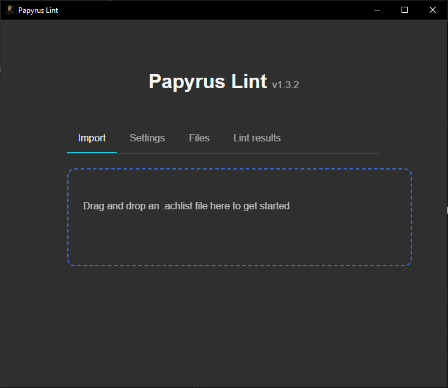
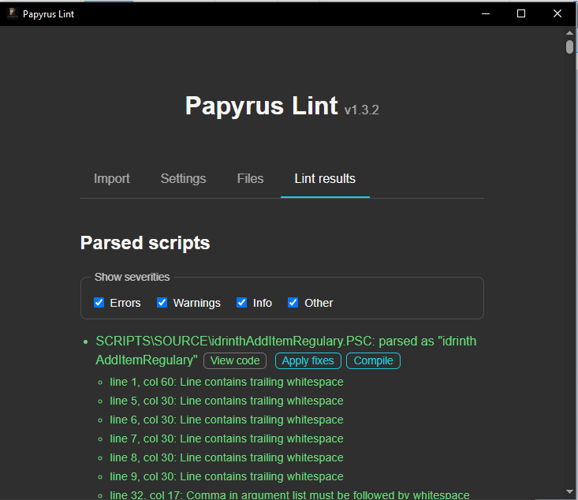
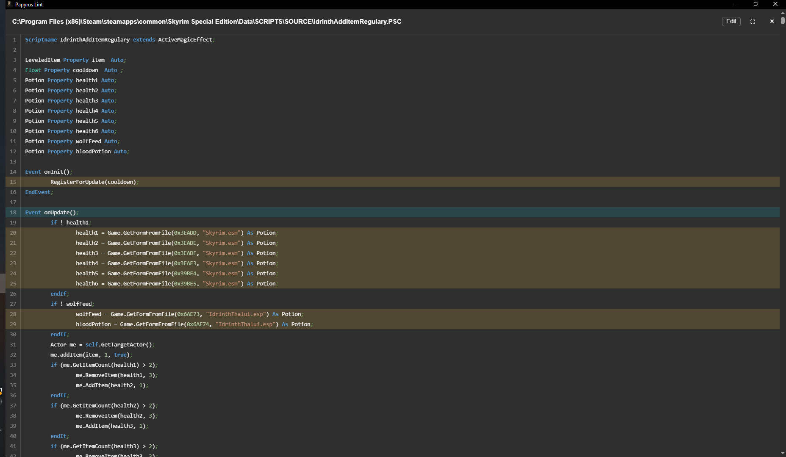
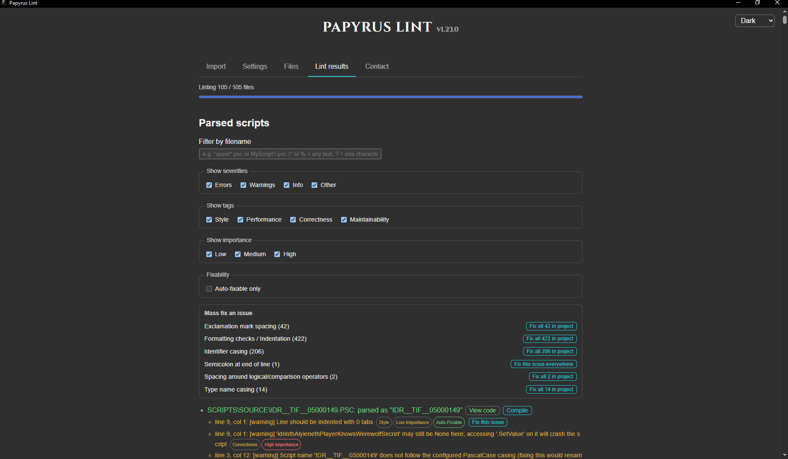
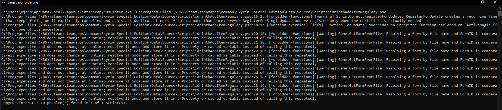

# Papyrus Lint

[](https://sonarcloud.io/summary/new_code?id=Idrinth_papyrus-lint) [](https://discord.gg/idrinth) [](https://www.nexusmods.com/skyrimspecialedition/mods/189862) [](https://github.com/idrinth/papyrus-lint) [](https://github.com/marketplace/actions/papyrus-lint) [](https://marketplace.visualstudio.com/items?itemName=Idrinth.papyrus-lint-vscode) [](https://tally.so/r/aQL1dB)


**Papyrus Lint goes far beyond style: it catches bugs that CreationKit's
compiler lets through.**
`PapyrusCompiler.exe` only checks that a script is syntactically valid — it
will happily compile a script that dereferences a `None` object at
runtime, passes a `String` where an `Int` is expected, returns the wrong
type from a function, compares an `Int` to a `Float` inexactly, or
contains a branch or statement that can never execute. Those bugs don't
show up until later, as a CTD, a quest stage that never advances, or a
value that's silently wrong — often far from the line that actually
caused them, and long after the mod author has lost the context to spot
it. Papyrus Lint performs deep correctness, reliability, and performance
checks across your `.psc` source (see the full list below), on top of the
formatting and style checks a linter usually provides, so a mod author
finds these problems at write time instead of from a bug report.

## Simple Example

```papyrus
Function DoSomething(Actor a, Actor b, Form SomeItem)
    a.RemoveItem(SomeItem, 1, b);
EndFunction
```

This compiles, but the likely desired version is:

```papyrus
Function DoSomething(Actor a, Actor b, Form SomeItem)
    a.RemoveItem(SomeItem, 1, false, b);
EndFunction
```

If you don't want this to turn up, because you actually meant what you wrote:

```papyrus
Function DoSomething(Actor a, Actor b, Form SomeItem)
    a.RemoveItem(SomeItem, 1, b); @disable 
EndFunction
```

The strict boolean check identifies this issue because the first call passes
the `Actor` value `b` to a `Bool` parameter. This specific mistake cost me a
good two hours finding manually in one of my mods.



Just drop your file, folder or achlist here and see the results.

See [more examples](docs/examples.md) of bugs Papyrus Lint catches that
`PapyrusCompiler.exe` lets through.

## What this is NOT

- A compiler (this uses the standard papyrus compile under the hood)
- An editor(see VSCode or Sublime Text for editors supported by our plugins)
- A guarantee a script is fit for purpose
- A replacement for proper testing
- An AI or AI-powered


## What is a linter?

A linter is a tool that scans source code for patterns that are likely to be
mistakes, bad practice, or inconsistent style, without actually running the
code. It works from heuristics — recognizable patterns known to often cause
problems — rather than proving that a given line is definitely wrong.
Because of that, a linter can produce **false positives**: diagnostics on
code that is actually fine, especially for patterns the checks intentionally
can't fully resolve (see e.g. "Strict boolean check" or "None used as an
existing Form" below, which skip anything they can't determine with
confidence rather than guess). It's normal to disagree with an individual
diagnostic and dismiss it.

Treat every diagnostic here as **advice, not a guaranteed defect report**: a
suggestion worth a second look, not proof the code is broken. Use your own
judgment for whether a flagged line needs changing, and use the
[`; @disable`](#disabling-a-lint-on-a-specific-line) comment below to
silence a specific rule on a specific line (or [`; @disable-file`](#disabling-a-lint-on-a-specific-line)
to silence it across the whole file) when you've decided it doesn't apply.



## Implemented Lints



Every rule works from raw source or lexer tokens rather than requiring a
script that parses cleanly. For the full, searchable reference — every
rule's id, severity, tags, auto-fix support, and complete documented
behavior — see the [lint rule reference](https://papyrus-lint.idrinth.de/rules.html)
on the project website.

### Formatting

These lints make scripts easier to read by enforcing a consistent look
and feel. They are especially useful in group projects.

### Performance

To keep scripts running smoothly, this flags calls and patterns known to
run slower than necessary, most useful for anything running in a hot loop
or on a frequent update.

### Reliability

To catch mistakes that still compile fine but can misbehave once the game
is actually running, this checks cross-script calls, states, and type
usage for problems the compiler itself doesn't flag.

### Bugprone

To catch mistakes that compile clean but crash or silently do the wrong
thing at runtime, this flags patterns that are almost always bugs rather
than intentional code.

### Other

Everything that doesn't fit the categories above, from unused code and
excessive complexity to naming and configuration-driven style
preferences.

The formatting lints/fixes (trailing whitespace, space after comma,
semicolon, indentation, chain whitespace, exclamation mark spacing,
operator spacing, and assignment operator spacing) never flag or change a
line inside a
CreationKit-generated `;BEGIN FRAGMENT CODE`/`;END FRAGMENT CODE` block,
except the actual script code between a `;BEGIN CODE`/`;END CODE` pair
within it. Reformatting the rest of that block (fragment headers, the
generated function signature, `EndFunction`, or the markers themselves)
would make CreationKit fail to recognize the fragment.



## Disabling a lint on a specific line

A line carrying a trailing `; @disable <rule-id>[, <rule-id>...]` comment
has diagnostics from the named rule(s) suppressed for that line only, e.g.:

```papyrus
action = 1 ; @disable float-to-int
```

The desktop app's code viewer can add this comment for you instead of
typing it by hand — see its per-line "Ignore" button
[above](#fixing-lint-findings).

`; @disable` with no rule ids suppresses every lint on that line. Matching
against the directive's rule id(s) is case-insensitive. This only affects
linting — it does not change what automatic fixes do to that line. A
rule's id is named on its own row on the [lint rule
reference](https://papyrus-lint.idrinth.de/rules.html) (e.g. `float-to-int`
for "Implicit Float-to-Int conversion", linked directly at
[`#rule-float-to-int`](https://papyrus-lint.idrinth.de/rules.html#rule-float-to-int)).

A `; @disable-file <rule-id>[, <rule-id>...]` comment does the same across
the entire file instead of just the line it's written on, no matter where
in the file it appears, e.g.:

```papyrus
; @disable-file float-to-int
```

`; @disable-file` with no rule ids suppresses every lint in the file. It
accepts the same rule ids, matched the same case-insensitive way, and
likewise never changes what automatic fixes do. The **Unused disable
directive** lint (`unused-disable`) treats an `@disable-file` directive the
same way it treats `@disable`: an unknown rule id, or one that never
produces a diagnostic anywhere in the file, is flagged; a bare
`@disable-file` is flagged only when the whole file has no diagnostics at all.

## Configuration

Lint/fix behavior is configured via an optional YAML file named
`papyrus-lint.yaml` (or `papyrus-lint.yml`), placed at the project root:
next to the `.achlist` file you drop into the app, or, for a single
`.psc` file dropped directly, two directories above it (e.g. `Data` for
`Data/Scripts/Source/abc.psc`). Any key it omits falls back to its
default. The full default configuration, with every key documented inline,
is checked in at
[`docs/papyrus-lint.default.yaml`](docs/papyrus-lint.default.yaml) — it's
also what `PapyrusLinterCLI init` (or `init --preset strict`, the default)
writes into a project with no config file yet. `PapyrusLinterCLI init
--preset <name>` picks a different built-in (`standard`, `careful`) or
user-defined starting point instead, and the desktop app offers the same
presets from its own Settings/Presets tabs.

See the [configuration reference](docs/configuration.md) for what every
key does, how presets and the desktop app's Settings/Presets tabs work,
and [`docs/presets/`](docs/presets/) for each built-in preset's own
annotated YAML.

## Command-line interface



Besides its GUI, Papyrus Lint can lint non-interactively from the
command line two ways: by passing an `.achlist` (or a single `.psc`, or a
directory) path to the desktop app's own executable (`PapyrusLinter`), or
via the standalone `PapyrusLinterCLI` binary (`app/crates/papyrus-lint-cli`)
built and shipped separately for use cases — e.g. a CI pipeline — that
shouldn't need the desktop app's binary (and its GUI dependencies) at all.
Both accept the same argument and behave identically.

[See the docs](docs/cli.md) for more details.

Prebuilt `PapyrusLinterCLI`/`PapyrusLinterCLI.exe` standalone CLI binaries
for Linux, macOS, and Windows are attached to each [GitHub
release](https://github.com/Idrinth/papyrus-lint/releases), alongside the
desktop app's own bundles and a packaged copy of the two editor plugins.
The preferred way to run Papyrus Lint in CI is the [Papyrus Lint GitHub
Action](https://github.com/marketplace/actions/papyrus-lint)
(`idrinth/papyrus-lint-action`), which downloads `PapyrusLinterCLI` for you
and, on pull requests, posts findings as inline review comments on the
changed lines. See [`docs/github-actions-example.md`](docs/github-actions-example.md)
for a usage example.

### Docker

Each release also publishes a signed Alpine Linux CLI image to GitHub
Container Registry (`ghcr.io/idrinth/papyrus-lint`), scanning `/project`
recursively with an AST cache under `/cache` and Papyrus base scripts
mounted under `/base-scripts`. See the [Docker reference](docs/docker.md)
for the `docker run` invocation and how to verify a release's image/binary
signatures with `cosign`.

## Versioning

Papyrus Lint follows [Semantic Versioning](https://semver.org/). Release
versions use the `MAJOR.MINOR.PATCH` format: major releases contain breaking
changes, minor releases add backward-compatible functionality, and patch
releases contain backward-compatible fixes.

## Fixing lint findings

The desktop app can apply an auto-fixable lint's fix directly from the
Lint results tab or the code viewer — per file, per finding, or per rule
across the whole project — preview the change as a diff first, and add an
[`; @disable`](#disabling-a-lint-on-a-specific-line) comment for a finding
you'd rather ignore. The code viewer also re-lints live as you type. The
Lint results tab can export the current (filtered) findings as text or
JSON, or as a JSON document tailored for handing to an AI assistant,
including each finding's own detailed rule documentation and, optionally,
each file's source. See [Fixing lint findings](docs/fixing-findings.md)
for exactly what each button does and the export formats' full shape.

## Compiling a script

Each `.psc` file listed on the Lint results tab (and the code viewer's
editor, via "Save & Compile") has a button to recompile it with
`PapyrusCompiler.exe` and show the result inline, so a fix can be tried
out without leaving the app. Papyrus Lint also strips the compiling
machine's Windows username/computer name that the compiler embeds into
every `.pex`, and the `compile_check` config option runs the compiler as
part of linting itself, reporting its errors as `[error]` diagnostics
alongside the lint engine's own. See
[Compiling a script](docs/compiling-scripts.md) for the exact compiler
invocation and how each of these behaviors works.

## Thank Yous

A big thank you to WraithFallen for doing a massive testing run on the
versions of this tool, helping find bugs and improve it further with
their dedication to rooting out false positives.

A big thank you to Scrivener07 for helping me review the linting rules
in a long call. I appreciate the feedback and willingness to test what
I assumed to be best practice.

Another thank you to s3ngine and wall416 over on NexusMods for spotting
bugs and reporting them in the early development of the tool.

## How to help

You can help the project by:

- Providing examples of false positives.
- Providing examples of false negatives.
- Giving feedback on the existing rules.
- Proposing new rules or adjustments to existing rules.
- Reviewing code.
- Writing code.
- Writing or suggesting tests.
- Sponsoring development.
